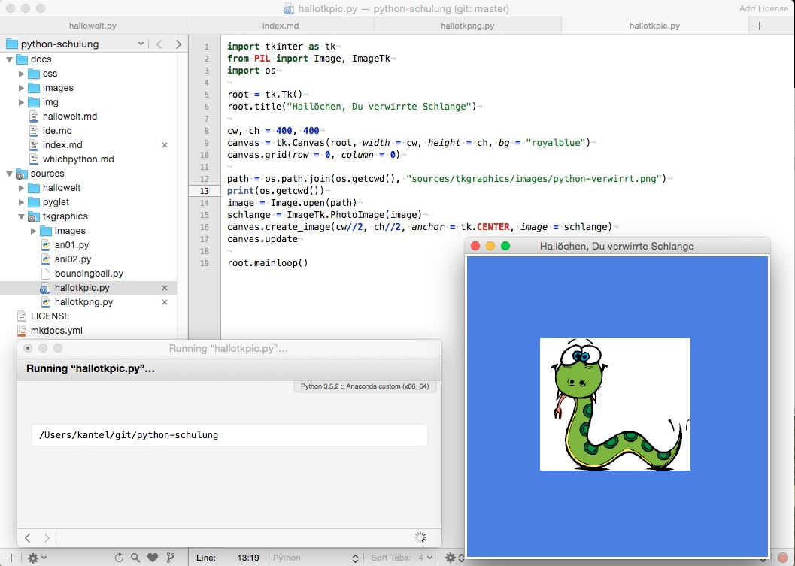

# Hallo Tkinter

**Tkinter** ist ein Wrapper für das GUI-Toolkit Tk (das ursprünglich für die Programmiersprache Tcl entwickelt wurde) für die Programmiersprache Python. Der Name steht als Abkürzung für *Tk interface*. Tkinter war das erste GUI-Toolkit für Python, weshalb es inzwischen auf macOS und Windows auch zum Lieferumfang von Python gehört. Im Gegensatz zu anderen GUI- und Graphik-Toolkits ist es also immer da und kann ohne vorherige Installationen verwendet werden.

Ein einfaches »Hallo Welt«-Programm mit einem Bild sieht in Python 3 mit Tkinter so aus:

~~~python
import tkinter as tk
from PIL import Image, ImageTk
import os

root = tk.Tk()
root.title("Hallöchen, Du verwirrte Schlange")

cw, ch = 400, 400
canvas = tk.Canvas(root, width = cw, height = ch, bg = "royalblue")
canvas.grid(row = 0, column = 0)

path = os.path.join(os.getcwd(), "sources/tkgraphics/images/python-verwirrt.png")
print(os.getcwd())
image = Image.open(path)
schlange = ImageTk.PhotoImage(image)
canvas.create_image(cw//2, ch//2, anchor = tk.CENTER, image = schlange)
canvas.update

root.mainloop()
~~~

Es sind in Python 3 einige Unterschiede zu Python 2.7 zu beachten:

1. Die Schreibweise der Bibliothek hat sich geändert. Statt `import Tkinter` heißt es nun `import tkinter`.

2. Statt Graphik-Bibliothek `PIL` ist die Verwendung der Fork `Pillow` empfehlenswert, da `PIL` [nicht mit Python 3 spielt](http://blog.schockwellenreiter.de/2016/08/2016081505.html).

Pillow kann mit

~~~bash
pip install Pillow
~~~

oder -- bei einem Anaconda-Python -- mit

~~~bash
conda install Pillow
~~~

installiert werden.

Ein aktuelles Pillow versteht `import Image` nicht mehr, stattdessen muß `Image` mit

~~~python
from PIL import Image
~~~

importiert werden. Diese beiden Sachen sind zu beachten, wenn Ihr alte Programm-Listings umschreiben wollt oder müßt.

Ansonsten -- wie die Definition der Titelzeile des Programmfensters zeigt -- ist Tkinter ziemlich UTF-8-fest. Aber nicht vollständig, Emojis beherrscht Tkinter (respektive Tcl) nicht. Will man zum Beispiel das Emoji für die Schlange »🐍« in obige Titelzeile einschmuggeln, dann bekommt man die Fehlermeldung:

~~~
TclError: 'character U+1f40d is above the range (U+0000-U+FFFF) allowed by Tcl'
~~~

Also alles, was größer `U+FFFF` ist, muß leider außen vor bleiben.

Ansonsten ist die Implementierung *straightforward*. Es wird ein 400 x 400 Pixel großer `Canvas` in das Root-Fenster eingebaut und in diesem das Bild geladen. Pillow wird benötigt, um das Bild zu laden und es in ein `Tkimage` zu konvertieren, denn Tk versteht nativ nur seht wenige Bildformate.

Ein kleines Problem ist die Pfadangabe zum Bild: Da ich auf meinen diversen Rechnern verschiedene Pfade zu dem jeweiligen `working directory` habe, nutze ich `os.getcwd()` um dieses Verzeichnis zu bekommen, um dann mit `os.path.join()` den vollständigen Pfadnamen zum Bild zu erhalten.

Wie oben schon angedeutet, wird das Bild dann mit der Pillow-Funktion `Image.open()` geladen und mit der Funktion `ImageTk.PhotoImage()` in ein Format konvertiert, das Tkinter versteht.

Danach habe ich die verwirrte Schlange mit den Zeilen

~~~python
canvas.create_image(cw//2, ch//2, anchor = tk.CENTER, image = schlange)
canvas.update
~~~

in der Mitte des Canvases anzeigen lassen. Das ist schon alles …

## Links

- [Tkinter im Python-Wiki](https://wiki.python.org/moin/TkInter)
- [Tkinter in der Wikipedia](https://de.wikipedia.org/wiki/Tkinter)
- [Pillow Homepage](https://python-pillow.org/)
- [Pillow-Dokumentation](https://pillow.readthedocs.io/)
- [PIL in der Wikipedia](https://en.wikipedia.org/wiki/Python_Imaging_Library)

## Tutorials

- GUI-Programmierung mit Python: [Python Tkinter Einführung](http://www.python-kurs.eu/python_tkinter.php) auf den Python-Seiten von *Bernd Klein*
- Tutorial: [Tkinter und Canvas](http://blog.schockwellenreiter.de/essays/tkinter01.html)