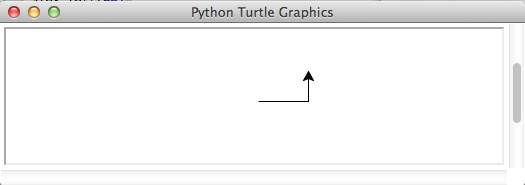

# Spaß mit Pythons Turtle-Graphik

Irgendwie wußte ich zwar, daß es existiert, aber eigentlich hatte ich es nie wirklich ernst genommen: Pythons Turtle-Graphik-Modul Bis ich es vor einigen Tagen neugierig doch einmal ausprobierte und da wußte ich, daß meine bisherige Arroganz ein Fehler war. Denn ich hatte wirklich viel Spaß mit diesem Modul.

Die Graphik mit der Schildkröte ist aus Logo bekannt und war eigentlich am MIT entwickelt worden, um Kindern den Einstieg in die Welt des Programmierens zu erleichtern. Doch dann wurde diese Art der Graphikprogrammierung schnell populär, selbst *Turbo Pacal* hatte eine Turtle-Paket.

Worum geht es da eigentlich? Es geht um eine (virtuelle) Schildkröte, die sich auf einem (ebenfalls virtuellem) Blatt Papier bewegt und einen Stift hält (ob in der Hand oder in der Schnauze, das ist nicht bekannt). Diese Schildkröte kann nun mit einfachen Befehlen wie »rechts«, »links«, »vorwärts« oder »rückwärts« gesteuert werden und zeichnet dabei ihren Weg auf diesem Blatt Papier. In Python sieht das so aus:

~~~python
import turtle

wn = turtle.Screen()
alex = turtle.Turtle()

alex.forward(50)
alex.left(90)
alex.forward(30)

wn.mainloop()
~~~

Zuerst muß das Turtle-Paket importiert werden. Dann wird der Bildschirm (das virtuelle Papierblatt) initialisiert und dann die Schildkröte (die ich »Alex« genannt habe). Und schon kann man der Schildkröte (also *Alex*) Befehle geben, die sie ausführt.

Die letzte Zeile dient dazu, das Blatt Papier in einer Schleife auch weiterhin auf dem Bildschirm anzuzeigen, damit man das Ergebnis seiner Programmierkunst auch bewundern kann:

Wichtig ist dabei, daß der Koordinatenursprung -- der Punkt `(0, 0)` nicht, wie es sonst in der Computergraphik üblich ist, in der linken obere Ecke des Graphikfensters (das ich ab sofort der Einfachheit halber *Canvas* nennen werde), sondern in der Mitte des Canvas’ liegt und von dort die positive X-Koordinate nach rechts und die positive Y-Koordinate nach oben zeigt. Der Canvas ist also ein karthesisches Koordinatensystem mit vier Quadrangen, wie es viele aus dem Schullunterricht noch kennen werden. Das heißt, links von der Mitte ist `x` negativ und unterhalb der Mitte ist `y` negativ. Daran muß man sich erst einmal gewöhnen. 😜

