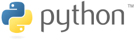
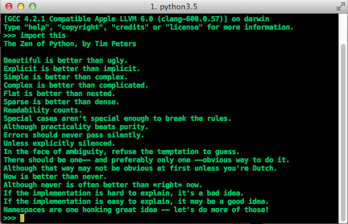
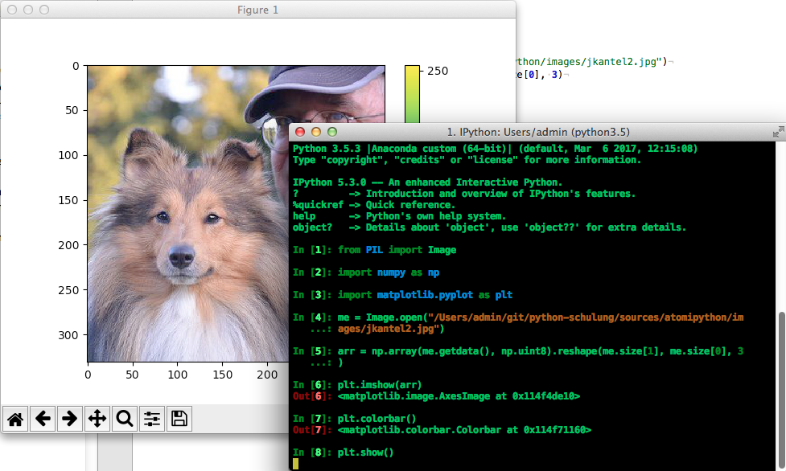
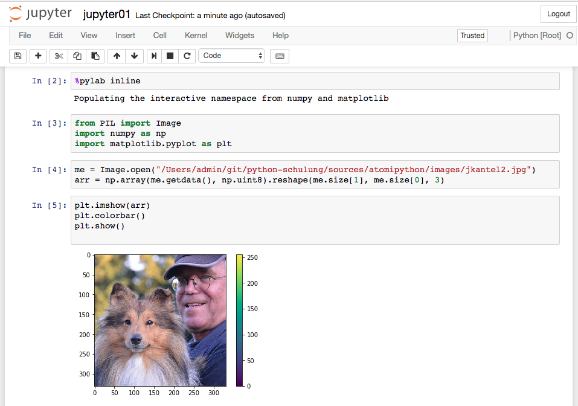
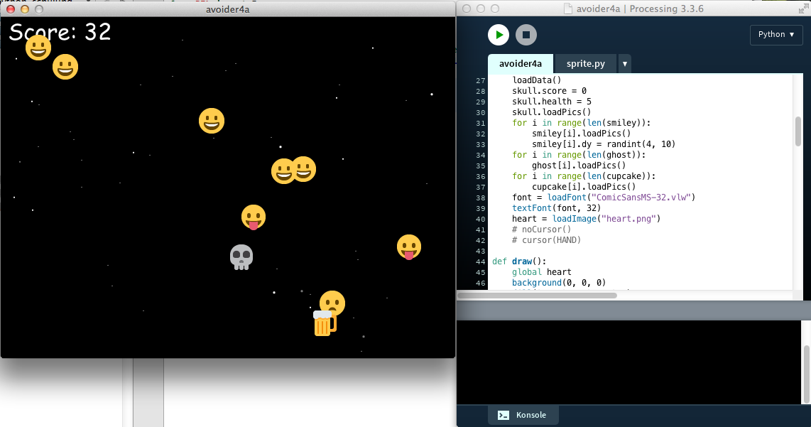
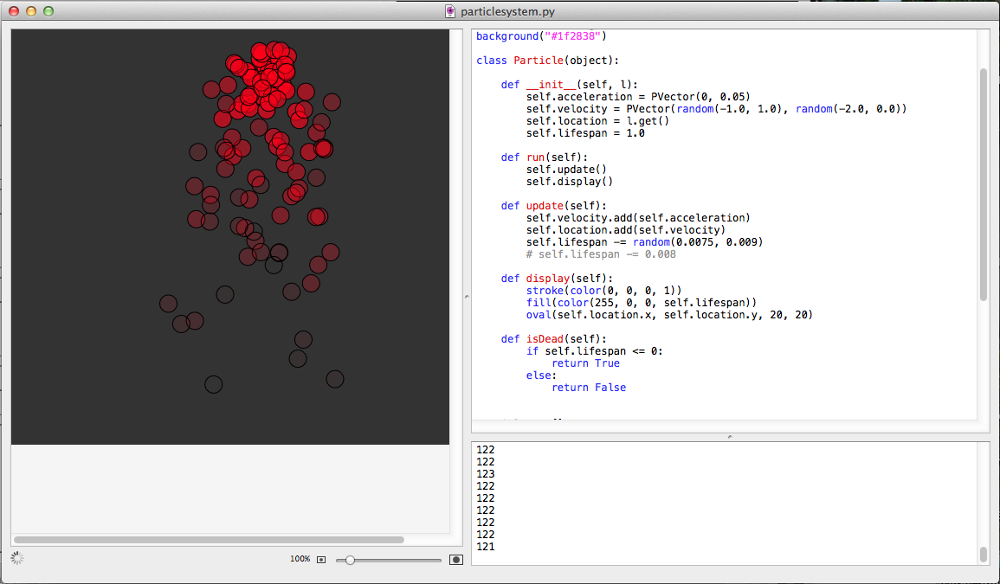
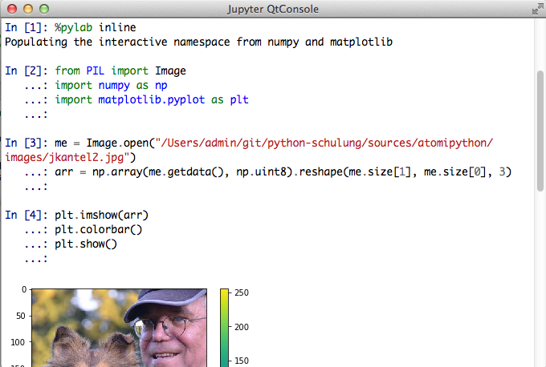
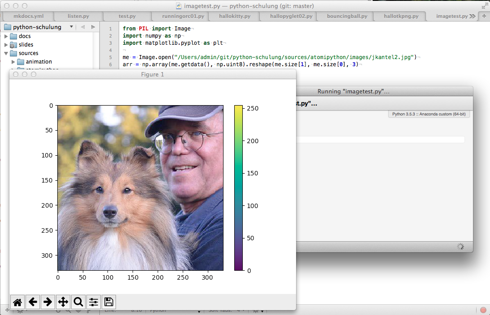
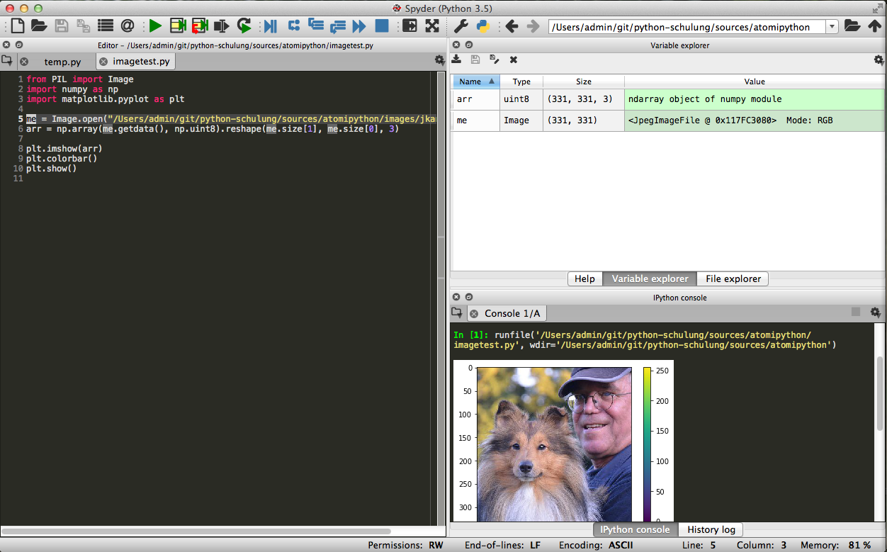
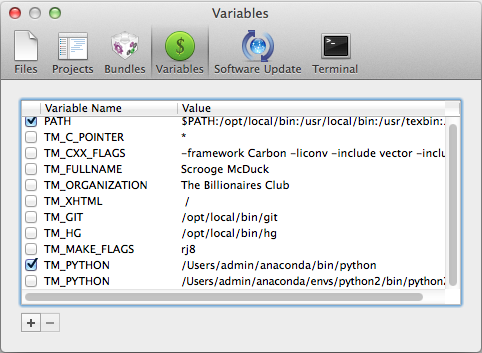

<!-- $theme: gaia -->
<!-- page_number: true -->


# Python für absolute Anfänger

(cc) 2017 by Jörg Kantel

---

# Hallo Welt 👋

```python
print("Hallo Jörg!")
```

- Man beachte, daß Python3 UTF-8-fest ist. 
- In Python 2.7 müßte das Skript folgendermaßen aussehen:

```python
# coding=utf-8

print(u"Hallo Jörg!")
```
---

# Was ist Python?



## Und warum sollte man Python lernen?

---

# Was ist Python?

- Python ist eine moderne Interpreter-Sprache
- Sie wurde 1991 von *Guido van Rossum* entwickelt
- Guido van Rossum war ein großer Fan der Komiker-Truppe *Monty Python*
- Dennoch hat sich das Schlangensymbol erhalten

---

# Was macht Python aus?

- Python wurde mit dem Ziel der größten Übersichtlichkeit und Einfachheit entworfen
- Der eigentliche Sprachkern (die *Schlüsselwörter*) ist klein, daher zuerst einmal leicht zu erlernen
- Python ist eine *Multiparadigmensprache*, sie zwingt Programmierern keinen Stil auf (z.B. prozedural, funktional oder objektorientiert zu programmieren)

---

# Die Vorteile von Python

- Für Programmieranfänger erst einmal leicht zu lernen
- *Batteries included*, das heißt, (fast) alles wichtige bringt Python in seinen Standard-Bibliotheken mit
- Leichte Lesbarkeit: Python ist *ausführbarer Pseudecode*
- Einige Bibliotheken (wie numpy, scipy, scikit-learn, pandas) haben Python zu einem *defacto*-Standard-Werkzeug für wissenschaftliches Rechnen und *Data Science* gemacht

---


# Aber … (die Nachteile von Python)

- Die Vielzahl der vorhandenen Bibliothekn verwirrt manchmal (entgegen dem *Zen of Python* gibt es für viele Probleme unterschiedliche Lösungen/Bibliotheken
- Der (unnötige) Bruch zwischen Python 2.7 und Python 3 hat die Community gespalten
- Python ist (nach heutigen Maßstäben) langsam (das kann aber durch in C oder FORTRAN geschriebene Bibliotheken kompensiert werden)


---

# Warum sollte man Python lernen?


---

# Warum sollte man Python lernen (2)?

- (C)Python ist plattformübergreifend (macOS, Windows, Linux, RaspberryPi, Android (aber kein iOS)
- Python ist vielseitig (wissenschaftliches Rechnen, Web-Entwicklung, Spiele und Simulationen etc.)
- Die Programmierung mit Python macht Spaß

---

# The Zen of Python

~~~python
import this
~~~



---

# Python 2 oder Python 3?

- Python 2.7 war lange Zeit Standard
- In Python 3 wurden einige Änderungen vorgenommen, über die nicht alle glücklich sind
- Python 2.7 wird mindestens bis 2020 gepflegt (Security Updates etc.)
- Aber nur Python 3 wird noch weiterentwickelt

---

# Should I stay or should I go?

**Python 3**

- Wenn es geht! (Unterstützen alle gebrauchten Bibliotheken Python 3?)
- Wenn man auf standardisierte Unicode- (UTF-8-) Unterstützung angewiesen ist
- Wenn man zukunftsfähig programmieren will oder muß

---

# Aber

**Python 2.7**

- Wenn es nicht anders geht (zum Beispiel PyGame oder NodeBox einsetzen möchte)
- Jython! (dazu später mehr)
- Wenn man auf einen Fundus von Bibliotheken (speziell zu Netzwerken) zurückgreifen muß
- Wenn man Python 2.7 liebt (und die Neuerungen in Python 3 nicht mag)

---

# Also?

- Im Zweifelsfalle Python 3

- Ich werde während dieses Kurses meistens Python&nbsp;3 verwenden, aber immer auf die Unterschiede zu Python 2.7 hinweisen

- Aber einige von den Methoden in Python 3 nicht verwenden (man braucht dieses Informatikergew****e nicht, um sauber in Python zu programmieren (die wichtigsten werde ich aber zumindest erwähnen)


---

# Das Python-Universum

- Python oder CPython
- Jython
- Stackless Python
- PyPy
- IronPython und PythonNet

---

# CPython

- **Python** oder **CPython** ist die Standard-Referenz-Implementierung (in C geschrieben und mit allen wichtien Bibliotheken (zum Beispiel numpy, scipy, pandas) kompatibel

- Gibt es als Python 2.7 und Python 3

---

# Jython

- **Jython** ist eine in Java geschriebene Python-Implementierung. Sie ist weitestgehend mit Python 2.7 kompatibel. Naturgemäß funktionieren nicht alle (in C geschriebenen) Bibliotheken
- Kann mit Java-Bibliotheken verknüpft werden (Swing)
- Wichtige Implementierungen:
    - Processing.py
    - TigerJython
---

# Die anderen

- **Stackless Python** ist ein CPython für Multi-Prozessor-Umgebungen
- **PyPy** ist ein Python geschriebener in Python-Interpreter. Es soll unglaublich schnell sein (nur Python 2.7)
- **IronPython** und **PythonNet** sind Python-Interpreter für Microsofts .NET-Umgebung. Beide verfolgen aber einen unterschiedlichen Ansatz für die Integration, wobei IronPython die Nase vorne hat

---

# Was ich in diesem Kurs vorstellen möchte

- (C)Python 3 (und gelegentlich 2.7)
- IPython und Jupyter (Python 3)
- Processing.py (Jython)
- NodeBox 1 (Python 2.7, Mac only)
- (evtl.) PyGame (Python 2.7)

---

# Python 3 mit IPython



---

**Python 3 mit Jupyter**



---

# Processing.py



---

# Nodebox 1



---


# Welches Python?

- Python ist auf jedem Mac vorinstalliert (System-Python)
- Das System-Python wird auch vom OS genutzt
- Daher besser nicht anrühren
- Anaconda-Python ist die Lösung für (fast) alles

---

# In Python programmieren

- Im Interpreter (REPL)
- Skzzieren (wie in Processing)
- IDE

---

# Python Interpreter

- `python` im Terminal oder iTerm aufrufen
- `ipython` im Terminal oder iTerm aufrufen
- IDLE (ist bei jeder Python-Distribution dabei)
- Fast jede IDE hat auch einen Interpreter eingebaut
- Der Interpreter wird mit `exit()` verlassen

---

**IPython**

IPython kann im Terminal oder iTerm, im Jupyter-Notebook oder in der `qtconsole` aufgerufen werden:



---

# Skizzen mit TextMate

- **TextMate 2** (Open Source, Mac only) ist zur Zeit mein bevorzugter Editor für Python (und fast alles andere auch)
- Seit kurzem ist allerdings **Visual Studio Code** (ebenfalls Open Source, aber plattformübergreifend) in der Andaconda-Distribution enthalten
- Editoren sind Geschmacksfrage (die plattfromübergreifenden Editoren **Atom** (Open Source) und **Sublime Text** (kommerziell) sind ebenfalls beliebt)

---

# Skizzieren mit TextMate (2)



---

# IDEs

- **PyCharm** (Community oder Enterprise) Edition
    - Speziell die *Enterprise Edition* ist wegen der Unterstützung von Web-Frameworks (Django) interessant
- **Spyder** wird bei Anaconda mitgeliefert
- <del>**Rodeo**</del> wird momentan leider nicht mehr weiterentwickelt

Mir persönlich sind IDEs zu schwerfällig, aber auch das ist eine Geschmacksfrage.

---

# Spyder




---

# Installationen für diesen Kurs

- Anaconda-Python
- TextMate

## Eventuell in einer späteren Sitzung

- PyGame
- Processing.py
- NodeBox 1

---

# TextMate-Anpassungen

