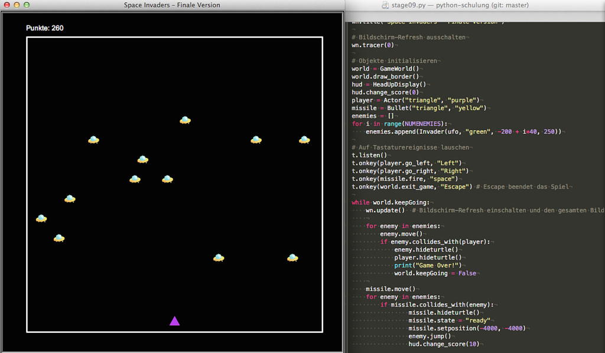
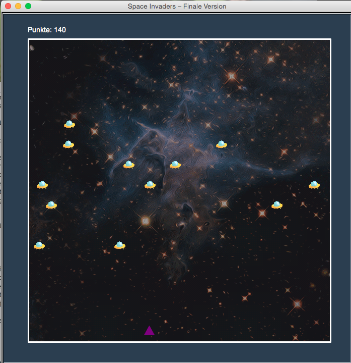

# Space Invaders mit Python und der Turtle

[](https://www.flickr.com/photos/schockwellenreiter/26597675517/)

[Space Invaders](https://de.wikipedia.org/wiki/Space_Invaders) ist ein Klassiker in der Geschichte der Computerspiele und erschien erstmals 1978 für Spielekonsolen. In japanischen Spielhallen war es so populär, daß nach kurzer Zeit die 100-Yen-Münzen im ganzen Land knapp wurden.

Die 1979 erschienene Umsetzung des Spiels auf die bis dahin eher schleppend laufende Spielkonsole [Atari 2600](https://de.wikipedia.org/wiki/Atari_2600) brachte den Durchbruch der Videospiele im Heimmarkt.

In diesem Beitrag möchte ich eine (eigenwillige) Version dieses Klassikers mit Python und dem Turtle-Modul programmieren. Ich beginne mit einem schlichten Template und arbeite mich dann Stage für Stage durch bis zum fertigen Spiel.

## Stage 1: Ein Template für ein Turtle-Spieleprogramm

Das Template ist von ergreifender Schlichtheit und macht nichts anderes, als ein 700x700 Pixel große Fenster mit einem schwarzen Hintergrund zu öffnen:

```python
# Space Invaders Stage 1: Template für Turtle-Programme

import turtle as t

WIDTH = 700
HEIGHT = 700

# Hier kommen die Klassendefinitionen hin


# Initialisierung

wn = t.Screen()
wn.bgcolor("#000000")
wn.setup(width = WIDTH, height = HEIGHT)
wn.title("Space Invaders – Stage 1")

# Bildschirm-Refresh ausschalten
wn.tracer(0)

def exitGame():
    global keepGoing
    keepGoing = False

# Auf Tastaturereignisse lauschen
t.listen()
t.onkey(exitGame, "Escape") # Escape beendet das Spiel

keepGoing = True
while keepGoing:
    wn.update()  # Bildschirm-Refresh einschalten 
                 # und den gesamten Bildschirm neuzeichnen
```

Es importiert erst einmal das Turtle-Modul und legt die Konstanten für die Breite und Höhe des Fensters fest. Dann wird das Fenster initialisiert und mit einem Titel versehen.

Eine Besonderheit ist der Befehl `wn.tracer(0)`. Denn im »Normalbetrieb« versucht jede Turtle kontinuierlich, jeden Graphikbefehl sofort abzuarbeiten und zu zeichnen. Das wird mit diesem Befehl ausgeschaltet, solange wie er gültig ist, wird mit allen Zeichnungen nur ein *Buffer* gefüllt.

Erst der Befehl `wn.update()` kopiert den Inhalt dieses Buffers auf den Bildschirm. Dies passiert in der Hauptschleife des Programms, so daß nur einmal je Durchlauf  der Inhalt des Buffers auf den Bildschirm kopiert wird. Dies beschleunigt die Graphikausgabe enorm.

Diese Version von *Space Invaders* soll über die Tastatur gesteuert werden, dafür muß ein *Listener* eingerichtet werden.

Zur Zeit lauscht er nur auf die *Escape*-Taste, mit der das Spiel beendet wird.

## Stage 2: Die Spielewelt zeichnen

Leider ist das Weite und Höhe des Fensters im Turtle-Modul »brutto«, also inklusiv der Ränder, die auch noch je nach Betriebssystem unterschiedlich breit sein können. Daher sollte die Spielewelt deutlich innerhalb des Fensters liegen. Ich habe mich für eine 600x600 Pixel große Welt entschieden, die ich im Fenster zentriere. Dazu habe ich erst einmal zwei weitere Konstanten definiert:

```python
WW = 600
WH = 600
```

Natürlich wollte ich *Space Invaders* mit allen Vorzügen der Objektorienterung implementieren, und so habe ich erst einmal die Klasse `GameWorld` definiert:

```python
class GameWorld(t.Turtle):
    
    def __init__(self):
        t.Turtle.__init__(self)
        self.penup()
        self.hideturtle()
        self.speed(0)
        self.color("white")
        self.pensize(3)
        self.keepGoing = True
    
    def draw_border(self):
        self.penup()
        self.goto(-WW/2, -WH/2)
        self.pendown()
        for i in range(4):
            self.forward(WW)
            self.left(90)

    def exit_game(self):
        self.keepGoing = False
```

Sie ist für nichts anderes zuständig, als einmal um die Spielewelt einen weißen Rahmen zu ziehen und zum anderen habe ich die Funktion `exit_game()` zu einer Methode dieser Klasse gemacht. Damit verhindere ich, daß ich `keepGoing` als *global* definieren muß und halte den Namensraum sauber. Somit kann ich die in *Stage 1* definierte globale Funktion `exitGame()` eliminieren.

Das bedingt allerdings folgende Änderung im *Listener*:

```python
t.listen()
t.onkey(world.exit_game, "Escape") # Escape beendet das Spiel
```

Darüber wird die Welt initialisiert und die Methode zum Zeichnen des Randes aufgerufen:

```python
# Objekte initialisieren
world = GameWorld()
world.draw_border()
```


Alles andere bleibt gleich. Wenn wir nun das Programm aufrufen, wird die Welt initialisiert und mit einem weißen Rand versehen. Und nach wie vor beendet die *Escape*-Taste das Programm, auch wenn der Listener nun eine Methode und keine Funktion mehr aufruft.

## Stage 3: Die Klasse Sprite und den Spieler hinzufügen

Ursprünglich war ein [Sprite](https://de.wikipedia.org/wiki/Sprite_(Computergrafik)) (englisch für *Geistwesen* oder *Kobold*) ein Graphikobjekt, das von der Graphikhardware über das Hintergrundbild beziehungsweise den restlichen Inhalt der Bildschirmanzeige eingeblendet wird. Die Positionierung wurde dabei komplett von der Graphikhardware erledigt.

Heute ist die echte Sprite-Technik überholt, vor allem, da Computer inzwischen schnell genug sind, ohne Probleme tausende spriteartige Objekte auf dem Bildschirm darzustellen und zugleich den Hintergrund in ursprünglicher Form wiederherzustellen. Auch der dafür nötige Speicherplatz ist weniger wichtig geworden. Dennoch hat sich der Begriff *Sprite* auch verallgemeinernd für Objekte gehalten, die nun per Software (statt Graphikhardware) über den Hintergrund eingeblendet werden. Solche *Software-Sprites* sind heute die Grundlage fast jeden Computerspiels und daher ist es sinnvoll, ihnen eine eigene Klasse zu widmen:

```python
class Sprite(t.Turtle):
    
    def __init__(self, tshape, tcolor):
        t.Turtle.__init__(self)
        self.penup()
        self.speed(0)
        self.shape(tshape)
        self.color(tcolor)
        self.speed = 1
```

Auch Klasse `Sprite` erbt alle Eigenschaften der Klasse `Turtle`. Sie ist momentan noch ein wenig schmalbrüstig, aber schon mächtig genug, daß von ihr der Spieler abgeleitet werden kann (schließlich erbt sie alle Methoden der `Turtle`):

```python
class Actor(Sprite):
    
    def __init__(self, tshape, tcolor):
        Sprite.__init__(self, tshape, tcolor)
        self.speed = 10
        self.x = 0
        self.y = -280
        self.setheading(90)
        self.goto(self.x, self.y)
        
    def go_left(self):
        self.x -= self.speed
        if self.x <= -WW/2 + 20:
            self.x = -WW/2 + 20
        self.setx(self.x)

    def go_right(self):
        self.x += self.speed
        if self.x >= WW/2 - 20:
            self.x = WW/2 - 20
        self.setx(self.x)
```
Da ich den Spieler mit Hilfe der Pfeiltasten nach rechts oder links bewegen möchte, er aber sonst am unteren Fensterrand bleibt (sich also nicht vertikal bewegen soll), habe ich die Methoden `go_left()` und `go_right()` implementiert. Sie enthalten jeweils eine Ränderabfrage, so daß der Spieler nicht versehentlich die Spielewelt verlassen kann.

Ansonsten ist er einfach ein purpurfarbenes Dreieck, das um 90 Grad gedreht nach Norden zeigt:

```python
player = Actor("triangle", "purple")
```

Natürlich mußte auch noch der *Listener* um die beiden Pfeiltasten erweitert werden:

```python
t.onkey(player.go_right, "Right")
t.onkey(world.exit_game, "Escape") # Escape beendet das Spiel
```

Wir haben nun eine Spielfigur, die wir mit den Pfeiltasten nach rechts und links bewegen können. Als nächstes sollten wir den Spieler einen Gegner spendieren.

## Stage 4: Die Klasse Enemy für den Gegner

Um einem Gegner zu implementieren, wird erst einmal eine Klasse `Invader` benötigt, die (Überraschung!) ebenfalls von `Sprite`abgeleitet wird:

```python
class Invader(Sprite):
    
    def __init__(self, tshape, tcolor):
        Sprite.__init__(self, tshape, tcolor)
        self.speed = 2
        self.x = -200
        self.y = 250
        self.goto(self.x, self.y)
    
    def move(self):
        self.x += self.speed
        if self.x >= WW/2 - 20 or self.x <= -WW/2 + 20:
            self.y -= 40
            self.sety(self.y)
            self.speed *= -1
        self.setx(self.x)
```
Der Gegener ist – wie die Initialisierung zeigt – einfach eine grüne Scheibe:

```python
enemy = Invader("circle", "green")
```
Da sich der Gegener autonom mit der Methode `move()` bewegt, müssen wir diese in der Hauptschleife aufrufen:

```python
while world.keepGoing:
    wn.update()
    enemy.move()
```
Auch die Methode `move()` fragt die Ränder ab. Im Gegensatz zum Spieler können wir den rechten wie den linken Rand in *einer* mit `or` verknüpften Abfrage prüfen. Wird einer der Ränder erreicht, wird die y-Koordinate um 40 Pixel nach unten verschoben. Und eine Richtungsänderung wird einfach mit

```python
            self.speed *= -1
```

erreicht, da ja bekannt die Multiplikation mit `-1` das Vorzeichen wechselt.

## Stage 5: Eine Rakete für den Spieler

Bislang ist das Spiel noch ziemlich langweilig. Um das zu ändern, werde ich nun eine Rakete für den Spieler hinzufügen. Damit es nicht zu einfach wird, soll diese Rakete immer nur dann abgefeuert werden, wenn gerade keine andere Rakete im Spiel ist. Dafür habe ich erst einmal die Klasse `Bullet` angelegt, die natürlich ebenfalls von `Sprite` erbt.

```python
class Bullet(Sprite):
    
    def __init__(self, tshape, tcolor):
        Sprite.__init__(self, tshape, tcolor)
        self.speed = 20
        self.setheading(90)
        self.shapesize(0.3, 0.5)
        self.state = "ready"
        self.hideturtle()
```

Die Rakete sollte natürlich etwas kleiner und schlanker als der Spieler sein. Daher habe ich sie mit `self.shapesize(0.3, 0.5)` etwas schrumpfen lassen. Und da eine Rakete natürlich schnell sein sollte, habe ich das mit `self.speed = 20` berücksichtigt.

Der Status der Rakete wird mit `self.state = "ready"` initialisiert. Sie soll zwei mögliche Zustände besitzen, nämlich `ready` wenn sie zum Abfeuern bereit ist und `fire` solange, wie sie unterwegs ist. Das heißt, solange sie im Zustand `fire` ist, soll sie nicht erneut abgeschossen werden können. Der Übersicht halber habe ich dies in zwei Methoden aufgeteteilt:

```python
    def fire(self):
        if self.state == "ready":
            self.state = "fire"
            self.x = player.xcor()
            self.y = player.ycor() + 10
            self.setposition(self.x, self.y)
            self.showturtle()
        
    def move(self):
        if self.state == "fire":
            y = self.ycor()
            y += self.speed
            self.sety(y)
        if self.ycor() >= WH/2 - 20:
            self.hideturtle()
            self.state = "ready"
```

Damit ist die Klasse `Bullet` fertig. Soll die Rakete mit der Methode `fire()` abgeschossen werden, überprüft sie erst einmal, ob sie auch wirklich im Zustand `ready` ist. Wenn ja, wird der Zustand auf `fire` gesetzt. Und die Turtle etwas oberhalb der Koordinaten des Spielers platziert und sichtbar gemacht.

Die Methode `move()` überprüft, ob sich die Rakete überhaupt im Zustand `fire` befindet, denn nur dann muß sie sich bewegen. Wenn ja, werden die y-Koordinaten hochgesetzt und die Rakete auf die neuen Koordinaten bewegt. Erreicht sie den oberen Rand der Spielewelt, wird sie versteckt und ihr Zustand wechselt wieder zu `ready` – bereit, erneut abgefeuert zu werden.

Jetzt muß nur noch mit

```python
missile = Bullet("triangle", "yellow")
```

eine Instanz der Klasse initialisiert werden. Wie der Spieler ist sie ein Dreieck. Das ist natürlich nicht zwingend notwendig, auch ein kleiner Kreis (`circle`) wäre denkbar.

Da die Rakete mit der Leertaste abgefeuert werden soll, muß natürlich auch noch ein entsprechender *Lauscher* implementiert werden:

```python
t.onkey(missile.fire, "space")
```

Frage mich bitte niemand, warum die Leertaste (`space`) im Gegensatz zu den anderen Tasten mit kleingeschriebenen Anfangsbuchstaben angesprochen wird, ich weiß es nämlich nicht.

Zum Schluß muß die Rakete natürlich auch noch in die Hauptschleife integriert werden. Diese sieht dann so aus:

```python
while world.keepGoing:
    wn.update()
    
    enemy.move()
    missile.move()
```

Das Programm ist so -- wie jeder andere *Stage* auch -- lauffähig. Wird die Leertaste gedrückt, feuert der Spieler eine Rakete ab, die am oberen Rand des Spielfeldes verschwindet und dann wieder erneut einsatzbereit ist. Allerdings passiert noch nichts, wenn sie auf den Invader trifft. Dazu muß erst eine Kollisionserkennung implementiert werden.


## Stage 6: Kollisionen erkennen

Da das Spiel mindestens zwei Kollisionserkennungen braucht, nämlich einmal

- die Rakete trifft auf einen Invader und zum anderen
- ein Invader kollidiert mit dem Spieler

lohnt es sich, diese in der Oberklasse `Sprite`zu implementieren. Dafür habe ich dort noch diese Methode eingefügt:

```python
    def collides_with(self, obj):
        a = self.xcor() - obj.xcor()
        b = self.ycor() - obj.ycor()
        distance =  math.sqrt((a**2) + (b**2))
        if distance < 15:
            return True
        else:
            return False
```

Für die Abstandsberechnung mußte der gute, alte [Satz des Pythagoras](https://de.wikipedia.org/wiki/Satz_des_Pythagoras) herhalten, um den [euklidischen Abstand](https://de.wikipedia.org/wiki/Euklidischer_Abstand) zu berechnen. Um die Quadratwurzel (`sqrt`) berechnen zu können, muß zu Beginn des Programmes mit

```python
import math
```

Das Mathematikpaket aus der Standardbibliothek geladen werden. Das die Methode mit dem Abstand `< 15` recht gute Ergebnisse bringt, habe ich durch Probieren herausgefunden [^1].


[^1]: Es gibt sicher genauere Methoder der Kollisionserkennung, aber für dieses einfache Problem reicht die hier skizzierte völlig aus.

Die Abfrage beider möglichen Kollisionen (Invader trifft Player oder Rakete trifft Invader) erfolgt in der Hauptschleife, die dadurch deutlich an Umfang gewonnen hat:

```python
while world.keepGoing:
    wn.update()    
    enemy.move()
    if enemy.collides_with(player):
        enemy.hideturtle()
        player.hideturtle()
        print("Game Over!")
        world.keepGoing = False
    
    missile.move()
    if missile.collides_with(enemy):
            missile.hideturtle()
            missile.state = "ready"
            missile.setposition(-4000, -4000)
            enemy.jump()
``` 
Kollidiert einer der Invader mit dem Spieler, werden beide mit `hideturtle()` aus dem Verkehr gezogen, die Konsole gibt ein »Game Over!« aus und mit `world.keepGoing = False`wird die Hauptschleife und damit das Spiel beendet.

Trifft dagegen die Rakete auf einen Invader, wird die Rakete nicht nur aus dem Verkehr gezogen, sondern sie wird mit `missile.setposition(-4000, -4000)` sicherheitshalberauch noch weit außerhalb des Spielfeldspositioniert, damit nicht versehentlich noch weitere Kollisionen gemeldet werden können. Außerdem wird der Status der Rakete wieder auf `ready` gesetzt. Sie ist damit wieder bereit, neu abgefeuert zu werden.

Der Invader wiederum muß zur Strafe, weil er sich hat treffen lassen, mit der Methode `jump()` wieder zurück an die Ausgangsposition. Die ist neu und muß in der Klasse `Invader` implementiert werden:

```python
    def jump(self):
        self.x = -200
        self.y = 250
        self.speed = 2
        self.goto(self.x, self.y)
```

Damit der Invader sich dann auch in die »richtige« Richtung (von links nach rechts) bewegt, wird unabhängig vom aktuellen Vorzeichen die Geschwindigkeit mit `self.speed = 2` ebenfalls wieder auf den Anfangszustand gesetzt.

Jetzt ist das Spiel schon richtig spielbar, probiert es aus. Wenn die Rakete des Spielers auf den Gegner trifft, wird dieser zurückgeworfen. Trifft dagegen der Invader auf den Spieler, wird das Spiel gnadenlos beendet.

## Stage 7: Punkte, wir wollen Punkte

*Space Invader* war – wie jedes andere Konsolenspiel – nicht darauf ausgelegt, daß der Spieler gewinnen konnte. Der Spieler sollte nur eine Münze in den Automaten werfen und versuchte dann, so lange wie möglich am Leben zu bleiben, denn für jedes neue Spiel benötigte er eine neue Münze. Aber als Anreiz bekam der Spieler für jeden abgeschossenen Invader eine Punktzahl gutgeschrieben und die Spieler mit den höchsten Punktzahlen *(High Scores)* wurden -- wenn niemand spielte -- auf dem Monitor angezeigt. So wurden die Spieler motiviert, den *High Score* zu übertreffen (und neue Münzen in den Daddelkasten zu werfen).

Daher möchte ich in diesem Abschnitt auch die Abschußpunkte einführen und sie im Fenster anzeigen lassen. Dafür habe ich erst einmal die Klasse `HeadUpDisplay` eingeführt [^2]:

[^2]: *Head Up Display*, abgekürzt *HUD* werden bei Computerspielen die Anzeigen genannt, die am oberen Bildrand eingeblendet werden.

```python
class HeadUpDisplay(t.Turtle):
    
    def __init__(self):
        t.Turtle.__init__(self)
        self.penup()
        self.hideturtle()
        self.speed(0)
        self.color("white")
        self.goto(-WIDTH/2 + 50, HEIGHT/2 - 40)
        self.score = 0
    
    def update_score(self):
        self.clear()
        self.write("Punkte: {}".format(self.score), False, align = "left",
                    font = ("Arial", 14, "normal"))
    
    def change_score(self, points):
        self.score += points
        self.update_score()
```

Es wird keinen überraschen, daß auch diese Klasse eine Unterklasse von `Turtle` ist. Die Klasse verfügt über zwei Methoden, `update_score()` und `change_score()`. Streng genommen ist `update_score()` eigentlich keine Methode, sondern nur eine Funktion, da sie nur innerhalb des Objektes von `change_score()` aufgerufen wird. Sie löscht den bisherigen Punktestand und schreibt den aktuellen wieder an die gleiche Stelle. (Die Koordinaten habe ich übrigens ebenfalls durch Ausprobieren herausgefunden.)

`change_score()` ist von ergreifender Schlichtheit. Hier wird einfach die Punktzahl addiert und dann `update_score()` aufgerufen.

Das dazugehörende Objekt muß natürlich -- wie alle anderen Objekte auch -- initialisiert werden:

```python
hud = HeadUpDisplay()
hud.change_score(0)
```

Die Hauptschleife des Spiels hat hingegen nur eine einzige neue Zeile bekommen und sieht nun so aus:

```python
while world.keepGoing:
    wn.update()
        
    enemy.move()
    if enemy.collides_with(player):
        enemy.hideturtle()
        player.hideturtle()
        print("Game Over!")
        world.keepGoing = False
    
    missile.move()
    if missile.collides_with(enemy):
            missile.hideturtle()
            missile.state = "ready"
            missile.setposition(-4000, -4000)
            enemy.jump()
            hud.change_score(10)
```

Nach jedem Treffer bekommt der Spieler mit `hud.change_score(10)` zehn zusätzliche Punkte gutgeschrieben und diese Punkte werden am linken oberen Rand des Fensters angezeigt.

## Stage 8: Mehr Gegner

Mit nur einem Invader als Gegner ist das Spiel noch nicht richtig spannend. Daher werde ich in dieser Folge das Spiel mit mehr Invadern ausstatten. Ich habe ein wenig herumexperimentiert und mit zwölf Gegnern eigentlich den größten Spielspaß gehabt. Da ich das aber nicht verallgemeinern möchte, habe ich diese Zahl zu Beginn des Programms in einer Konstantendefinition fesgehalten:

```python
NUMENEMIES = 12
```

Die Leserin oder der Leser sind aufgefordert, selber mit der Anzahl der Gegner zu experimentieren.

Es ist ein großer Vorteil der objektorientierten Programmierung, daß eine solche, eigentlich gravierende Änderung kaum Änderungen am Programmcode verlangt. An den Klassendefinitionen muß nichts geändert werden. Damit nicht alle Gegner an der gleichen Position starten müssen, wurde der Konstruktor der Klasse `Invader` leicht erweitert:

```python
    def __init__(self, tshape, tcolor, x, y):
        Sprite.__init__(self, tshape, tcolor)
        self.speed = 2
        self.x = x
        self.y = y
        self.goto(self.x, self.y)
```

Er nimmt nun auch die gewünschten x- und y-Koordinaten der Objekte auf.

Natürlich sieht nun auch die Initialisierung der gegnerischen Objekte sieht etwas anders aus:

```python
enemies = []
for i in range(NUMENEMIES):
    enemies.append(Invader("circle", "green", -200 + i*40, 250))
```

Zuerst wurde eine leere Liste `enemies` angelegt. Solche Listen, die Objekte enthalten, werden meist per Konvention mit dem Plural der Objekte bezeichnet.

Dann werden in einer Schleife die einzelnen Invader initialisiert und mit `append()` der Liste hinzugefügt. Die y-Koordinate des Startpunktes aller Objekte bleibt dabei gleich, lediglich die x-Koordinaten sind jeweils um 40 Pixel nach rechts verschoben worden.

Die größten Änderungen gab es in der Hauptschleife, weil nun natürlich die beiden Blöcke, in denen es um die Invaders geht, jeweils in eine Schleife über alle `enemies` gepackt werden mußten:

```
while world.keepGoing:
    wn.update()
    
    for enemy in enemies:
        enemy.move()
        if enemy.collides_with(player):
            enemy.hideturtle()
            player.hideturtle()
            print("Game Over!")
            world.keepGoing = False
    
    missile.move()
    for enemy in enemies:
        if missile.collides_with(enemy):
                missile.hideturtle()
                missile.state = "ready"
                missile.setposition(-4000, -4000)
                enemy.jump()
                hud.change_score(10)
```

Aber das Programm ist dennoch recht überschaubar geblieben. Es ist im Prinzip die spielbare Endfassung, im letzten Abschnitt möchte ich es nur noch ein wenig aufhübschen.

## Stage 9: Final Touches


Zum Schluß möchte ich die Gegner mit dem Bild eines Ufos aufhübschen. Ich habe dieses Bild einem freien [Spriteset](https://gamedevelopment.tutsplus.com/articles/enjoy-these-totally-free-space-based-shoot-em-up-sprites--gamedev-2368) entnommen, das [Jacob Zinman-Jeanes](http://jeanes.co/) auf [Gamedevtuts+](https://gamedevelopment.tutsplus.com/) veröffentlich hat. Die Lizenzbedingungen verlangen eine Nennung der Urheber. Diesem bin ich hiermit nachgekommen.

Da das dem Spiel zugrundeliegende Turtle-Modul aus Pythons-Standard-Bibliothek in der Lage ist, GIF-Bilder als Shapes zu akzeptieren, waren nur noch zwei geringe Änderungen nötig. Zum einen mußte ich das Bild des Ufos als Shape registrieren:

```python
wn = t.Screen()
wn.bgcolor("#000000")
# wn.bgcolor("#2b3e50")
# path_to_bg = os.path.join(os.getcwd(), "sources/spaceinvaders/farback.gif")
# wn.bgpic(path_to_bg)
# ufo = os.path.join(os.getcwd(), "sources/spaceinvaders/ufo.gif")
ufo = "ufo.gif"
wn.register_shape(ufo)
```

Ich habe dies zu Beginn des Programms, an dem auch das Fenster initialisiert wird vorgenommen. Wie die Leserin oder der Leser an den auskommentierten Zeilen erkennt, habe ich auch versucht, dem Spiel ein Hintergrundbild zu verpassen. Das zwang aber mein neun Jahre altes MacBook in die Knie. Mein fünf Jahre jüngerer Mac Pro schaffte es allerdings die Animationen auch mit Hintergrundbild flüssig abzuspielen (wie der Screenshot unten zeigt) daher habe ich die auskommentierten Zeilen im Quelltext stehen gelassen, um zu eigenen Experimenten anzuregen.



Das Hintergrundbild stammt übrigens auch aus der oben erwähnten Sprite-Sammlung. Ich habe es in der Bildverarbeitung meines Vertrauens auf 600x600 Pixel zurechtgeschnitten und nach GIF konvertiert.

Die komplizierten, auskommentierten Pfadbasteleien sind meinen unterschiedlichen Entwicklungsumgebungen auf meinen diversen Rechnern geschuldet. Dazu habe ich dann auch nach das Paket `os` aus der Standardbibliothek importieren müssen. Wenn ihr das Spiel im Terminal startet reicht aber die Angabe

```python
ufo = "ufo.gif"
```

völlig aus (wenn das Bild im gleichen Verzeichnis wie Euer Programm liegt).

Zum Schluß darf allerdings nicht vergessen werden, den *Enemies* das Ufo als *Shape* auch zuzuweisen:

```python
for i in range(NUMENEMIES):
    enemies.append(Invader(ufo, "green", -200 + i*40, 250))
```

Puristen werden bemerken, daß die Übergabe der Farbe grün nun eigentlich überflüssig sei. Das stimmt, aber ich wollte die Klasse `Sprite`, die ja unter anderem auch für die Farbgebung zuständig ist, so variabel wie möglich halten. Und da die Farbe grün hoffentlich niemanden stört …

Mehr Änderungen waren nicht nötig, um dem Spiel den letzten Schliff zu geben. Natürlich könnte man noch viel mehr machen, man könnte -- wie im Original -- die Invaders in mehreren Reihen zugleich auf den Spieler zusteuern lassen und dabei die abgeschossenen Gegner auch aus der Liste löschen oder man könnte auch mehrere Level einführen. Das alles seien der geneigten Leserin oder dem geneigten Leser als eigenes Projekt für die Zukunft überlassen.

## Stage 10: Der vollständige Quellcode

Zum Schluß gibt es noch den vollständigen Quellcode der finalen Fassung zum Nachprogrammieren und bereit für weitere Erweiterungen:

```python
# Space Invaders Stage 9: Final Touches

import turtle as t
import math
import os

# Fenstergröße
WIDTH = 700
HEIGHT = 700
# Weltgröße
WW = 600
WH = 600
# Anzahl der Invaders
NUMENEMIES = 12

# Hier kommen die Klassendefinitionen hin

class GameWorld(t.Turtle):
    
    def __init__(self):
        t.Turtle.__init__(self)
        self.penup()
        self.hideturtle()
        self.speed(0)
        self.color("white")
        self.pensize(3)
        self.keepGoing = True
    
    def draw_border(self):
        self.penup()
        self.goto(-WW/2, -WH/2)
        self.pendown()
        for i in range(4):
            self.forward(WW)
            self.left(90)

    def exit_game(self):
        self.keepGoing = False

class HeadUpDisplay(t.Turtle):
    
    def __init__(self):
        t.Turtle.__init__(self)
        self.penup()
        self.hideturtle()
        self.speed(0)
        self.color("white")
        self.goto(-WIDTH/2 + 50, HEIGHT/2 - 40)
        self.score = 0
    
    def update_score(self):
        self.clear()
        self.write("Punkte: {}".format(self.score), False, align = "left",
                    font = ("Arial", 14, "normal"))
    
    def change_score(self, points):
        self.score += points
        self.update_score()

class Sprite(t.Turtle):
    
    def __init__(self, tshape, tcolor):
        t.Turtle.__init__(self)
        self.penup()
        self.speed(0)
        self.shape(tshape)
        self.color(tcolor)
        self.speed = 1

    def collides_with(self, obj):
        a = self.xcor() - obj.xcor()
        b = self.ycor() - obj.ycor()
        distance =  math.sqrt((a**2) + (b**2))
        if distance < 15:
            return True
        else:
            return False

class Actor(Sprite):
    
    def __init__(self, tshape, tcolor):
        Sprite.__init__(self, tshape, tcolor)
        self.speed = 10
        self.x = 0
        self.y = -280
        self.setheading(90)
        self.goto(self.x, self.y)
        
    def go_left(self):
        self.x -= self.speed
        if self.x <= -WW/2 + 20:
            self.x = -WW/2 + 20
        self.setx(self.x)

    def go_right(self):
        self.x += self.speed
        if self.x >= WW/2 - 20:
            self.x = WW/2 - 20
        self.setx(self.x)

class Bullet(Sprite):
    
    def __init__(self, tshape, tcolor):
        Sprite.__init__(self, tshape, tcolor)
        self.speed = 20
        self.setheading(90)
        self.shapesize(0.3, 0.5)
        self.state = "ready"
        self.hideturtle()
    
    def fire(self):
        if self.state == "ready":
            self.state = "fire"
            self.x = player.xcor()
            self.y = player.ycor() + 10
            self.setposition(self.x, self.y)
            self.showturtle()
        
    def move(self):
        if self.state == "fire":
            y = self.ycor()
            y += self.speed
            self.sety(y)
        if self.ycor() >= WH/2 - 20:
            self.hideturtle()
            self.state = "ready"

class Invader(Sprite):
    
    def __init__(self, tshape, tcolor, x, y):
        Sprite.__init__(self, tshape, tcolor)
        self.speed = 2
        self.x = x
        self.y = y
        self.goto(self.x, self.y)
        # self.edge = False
    
    def move(self):
        self.x += self.speed
        if self.x >= WW/2 - 20 or self.x <= -WW/2 + 20:
            self.y -= 40
            self.sety(self.y)
            self.speed *= -1
        self.setx(self.x)

    def jump(self):
        self.x = -200
        self.y = 250
        self.speed = 2
        self.goto(self.x, self.y)

# Initialisierung

wn = t.Screen()
wn.bgcolor("#000000")
# wn.bgcolor("#2b3e50")
# path_to_bg = os.path.join(os.getcwd(), "sources/spaceinvaders/farback.gif")
# wn.bgpic(path_to_bg)
# ufo = os.path.join(os.getcwd(), "sources/spaceinvaders/ufo.gif")
ufo = "ufo.gif"
wn.register_shape(ufo)

wn.setup(width = WIDTH, height = HEIGHT)
wn.title("Space Invaders – Finale Version")

# Bildschirm-Refresh ausschalten
wn.tracer(0)

# Objekte initialisieren
world = GameWorld()
world.draw_border()
hud = HeadUpDisplay()
hud.change_score(0)
player = Actor("triangle", "purple")
missile = Bullet("triangle", "yellow")
enemies = []
for i in range(NUMENEMIES):
    enemies.append(Invader(ufo, "green", -200 + i*40, 250))

# Auf Tastaturereignisse lauschen
t.listen()
t.onkey(player.go_left, "Left")
t.onkey(player.go_right, "Right")
t.onkey(missile.fire, "space")
t.onkey(world.exit_game, "Escape") # Escape beendet das Spiel

while world.keepGoing:
    wn.update()
    
    for enemy in enemies:
        enemy.move()
        if enemy.collides_with(player):
            enemy.hideturtle()
            player.hideturtle()
            print("Game Over!")
            world.keepGoing = False
    
    missile.move()
    for enemy in enemies:
        if missile.collides_with(enemy):
                missile.hideturtle()
                missile.state = "ready"
                missile.setposition(-4000, -4000)
                enemy.jump()
                hud.change_score(10)
```
